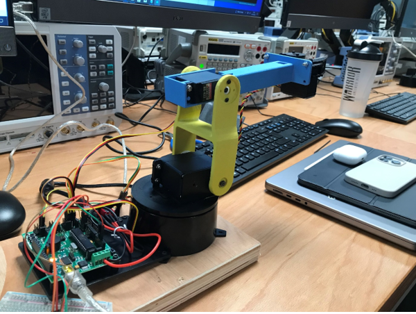

# Pick-and-Place-Robot

## Table of Contents
-> About the project

-> Project Files Decription

-> Getting Started

-> Reference

-> Acknowledgement

## About the project
The project aims to develop an automatic picking and placing three-axis robot. Through a camera, the robot can recognize specified objects and achieve automatic grasping and placing at predetermined coordinates.

The three-axis robot consists of three rotational axes and an end effector at the end, as shown in Fig. 1.
The rotational axes are used to move the end effector to the specified positions, while the end effector is used to grasp objects, thus enabling picking and placing operations.

Figure 1

## Project Files Decription

### Arduino_Code
This is an Arduino Uno control system designed to receive specified coordinates, calculate the angles of each joint using inverse kinematics, and then write these angles to the corresponding servos to move the robotic arm.
This system requires two head file, servo.h and math.h.

### Matlab_Code
The folder contains original images of the checkerboard pattern used for calibration. Seven different angled images of the checkerboard are used to calculate the intrinsic and extrinsic parameters during the camera calibration process, and two images are used for object localization. The MATLAB code is divided into four parts.
- **Vision1**
Based on the Camera Calibration methods of Professor Zhengyou Zhang[1], project automaticaly read of grid points from the photos, calculated the intrinsic and extrinsic parameters for camera calibration using the world and pixel coordinates of the corner points, and saved them as K_Lab.mat and Tcw_Lab.mat, respectively.

- **Vision2**
Based on the Cashbaugh method from Professor Jasmine Cashbaugh and Christopher Kitts[2], project utilize 7 sets of cooridnates with their cooresponding joint angle values of the robot, achieved automatic robot calibration and saved the transfer matrix as Trw_Lab.mat file.

- **Vision3**
By comparing two images, one with the object and one without, the position of the object is determined. Its position and orientation are saved in PObject_Lab.mat.

- **Vision4**
Load the matrixs and send to Arduino UNO for robot movement.

## Reference
[1] **Z. Zhang**, "A flexible new technique for camera calibration," in IEEE Transactions on Pattern Analysis and Machine Intelligence, vol. 22, no. 11, pp. 1330-1334, Nov. 2000, doi: 10.1109/34.888718.

[2] **J. Cashbaugh and C. Kitts**, "Automatic Calculation of a Transformation Matrix Between Two Frames," in IEEE Access, vol. 6, pp. 9614-9622, 2018, doi: 10.1109/ACCESS.2018.2799173.

## Acknowledgement
This project is a team effort, and its success relies on the collaboration of teammates. Thanks to **Hasya Hamdan**, **Adrian Salt**, and **Anselm Ogden**.

